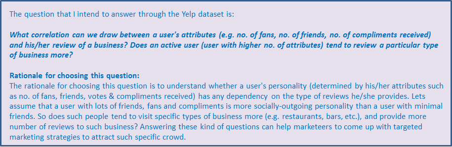
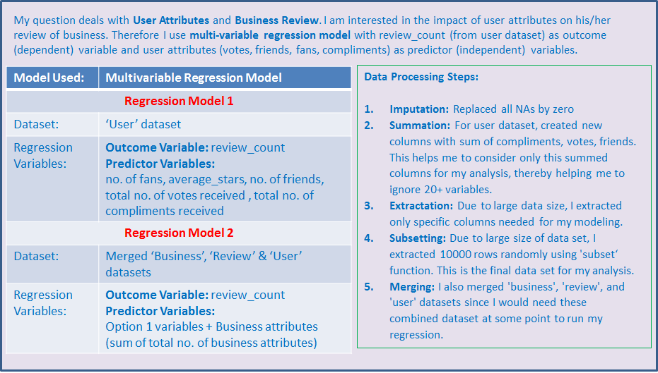
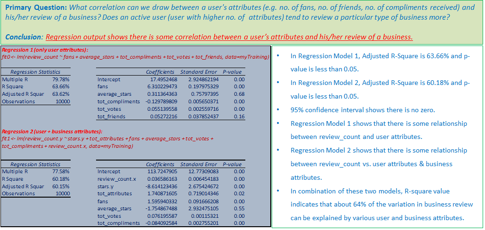
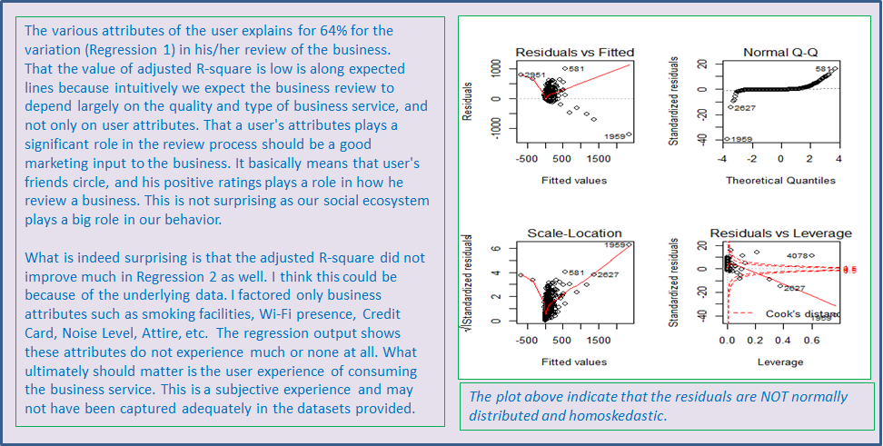

## Primary Question of Interest | Question/Problem and the Rationale for Studying it  {#nextsteps .emphasized}

## Methodology Used {#nextsteps .emphasized}

## Regression Modeling & Output {#nextsteps .emphasized}
I ran the regression model with the following variables and got the following output:

## Conclusion & Discussion {#nextsteps .emphasized}

